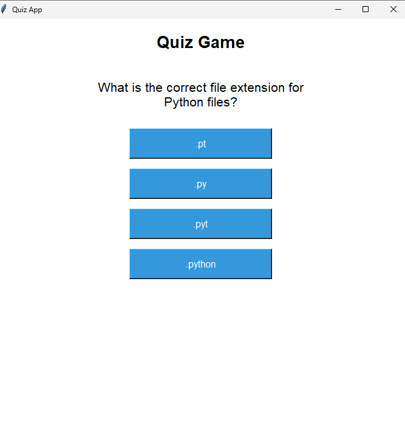
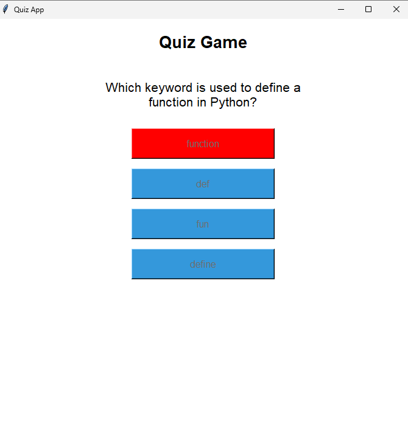
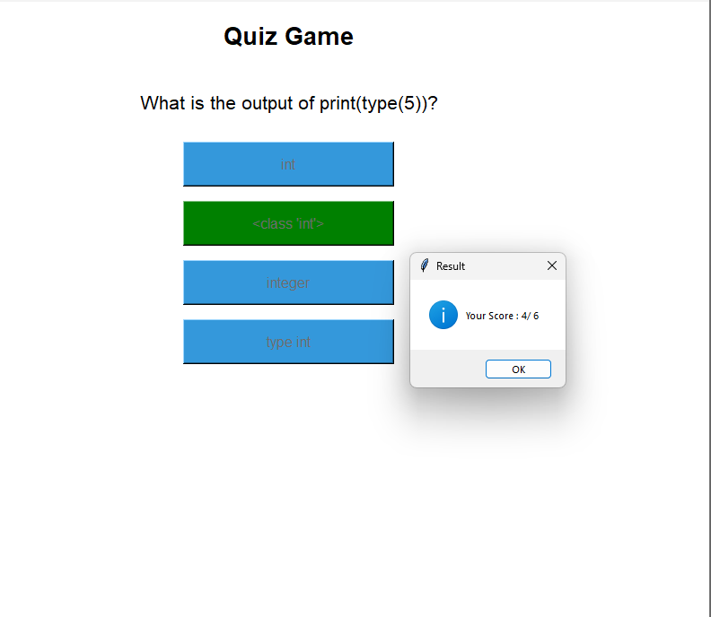

# 🧠 Quiz App (Python Tkinter)

A simple Python GUI-based quiz application built using Tkinter.  
This project is created for practice to understand GUI development, event handling, and basic Python logic.

---

## 📌 Features

- Multiple-choice questions
- Score tracking system
- Instant feedback (correct/wrong answer highlighting)
- Simple and clean GUI using Tkinter
- Beginner-friendly project structure

---

## 🖥️ Technologies Used

- Python 🐍
- Tkinter (GUI library)

---

## 🚀 How to Run

Make sure Python is installed on your system.
### 1. Clone this repository:

```bash
git clone https://github.com/your-username/quiz-app.git
```
### 2. Navigate to the project folder:
```
cd quiz-app
```
### 3. Run the application:
```
python quiz.py
```

---
## Screenshots

<br>

<br>


